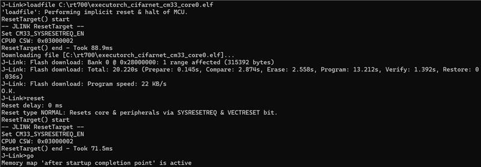
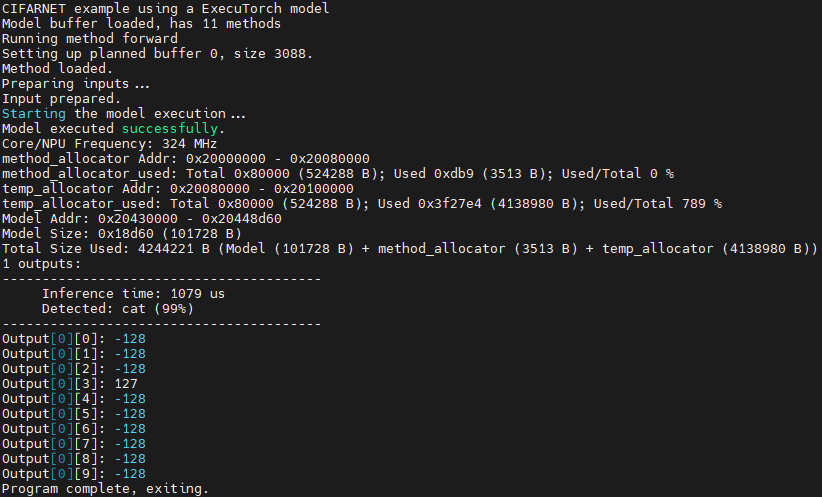
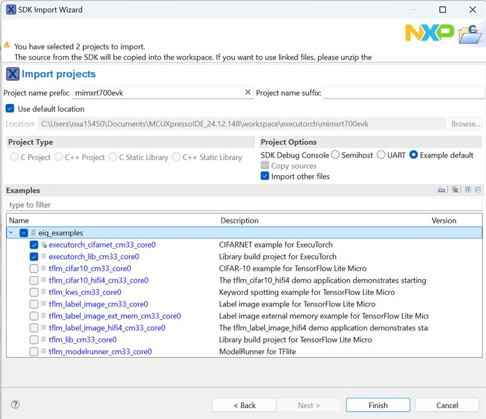

# MCUXpresso SDK Example applications

The MCUXpresso SDK provides a set of projects and example application with eIQ ExecuTorch. These demonstrate the functionality of the ExecuTorch
with the Neutron Backend, or enable building the ExecuTorch library itself, 
if code changes or customization is needed. See table below:

|Name| Description                                                                                                                                                                                                                                                                                                                                |Availability|
|----|--------------------------------------------------------------------------------------------------------------------------------------------------------------------------------------------------------------------------------------------------------------------------------------------------------------------------------------------|------------|
|`executorch_lib`| This project contains the ExecuTorch Runtime Library source code and is used to build the ExecuTorch Runtime Library. The library is further used to build a full application using ExecuTorch.                                                                                                                                  | MIMXRT700-EVK \(no camera and display support\) |
|`executorch_cifarnet`| Example application demonstrating the use of ExecuTorch running a CifarNet classification model accelerated on the eIQ Neutron NPU. The CifarNet is a small Convolutional Neural Network \(CNN\), trained on [CIFAR-10](https://www.cs.toronto.edu/~kriz/cifar.html) [1] dataset. The model classifies the input images into 10 categories. | MIMXRT700-EVK \(no camera and display support\) |

For details on how to build and run the example applications with supported toolchains, see *Getting Started with MCUXpresso SDK User’s Guide* \(document: MCUXSDKGSUG\).

### How to build and run `executorch_cifarnet` example

The example needs ExecuTorch Runtime Library and Neutron Libraries.

ExecuTorch Runtime Library: 
* `middleware/eiq/executorch/lib/cm33/armgcc/libexecutorch.a` for Cortex-M33 Core
* `middleware/eiq/executorch/lib/hifi4/xcc/imxrt700/libexecutorch.a` for HiFi4 Core

Neutron Libraries:
* Cortex-M33
  * `/middleware/eiq/neutron/rt700/cm33/libNeutronDriver.a` and 
  * `/middleware/eiq/neutron/rt700/cm33/libNeutronFirmware.a`
* HiFi4 DSP
    * `/middleware/eiq/neutron/rt700/hifi4/libNeutronDriver.a` and
    * `/middleware/eiq/neutron/rt700/hifi4/libNeutronFirmware.a`

In the example the model and the input image are already embedded into the program and ready to build and deploy to i.MX RT700, so you can continue right to the [building and deployment](#build-deploy-and-run) section. 

#### Convert the model and example input to C array 
In this section we describe where the model and example input is located in the example application sources, and how it was generated.

The **cifar10 model** ExecuTorch model is stored in `boards/mimxrt700evk/eiq_examples/executorch_cifarnet/cm33_core0/model_pte.h`,
and was generated from the `cifar10_nxp_delegate.pte` \(see [convert_model](convert_model.md)\).

We use the `xxd` command to get the C array containing the model data and array size: 
```commandline
$ xxd -i cifar10_nxp_delegate.pte > model_pte_data.h
```
then use the array data and size in the  `model_pte.h`.

As **input image** we use the image from [CIFAR-10](https://www.cs.toronto.edu/~kriz/cifar.html) dataset [1]. After preprocessing and normalization it is converted to bytes and located here: `boards/mimxrt700evk/eiq_examples/executorch_cifarnet/cm33_core0/image_data.h`. 
The preprocessing is performed as follows: 
```python
import torch
import torchvision
import numpy as np

batch_size = 1
transform = torchvision.transforms.PILToTensor()
test_set = torchvision.datasets.CIFAR10(root='./data', train=False, download=True, transform=transform)
test_loader = torch.utils.data.DataLoader(test_set, batch_size=batch_size, shuffle=False, num_workers=0)
index = 0
num_images = 10
for data in test_loader:
    images, labels = data
    for image, label in zip(images, labels):
        img_np = image.permute(1, 2, 0).contiguous().numpy() # Convert to HWC and numpy
        arr = (img_np - 128).astype(np.int8) # Center and cast to int8
        arr.tofile(f"img{index}_{label}.bin") # Save to file
        index += 1
        if index >= num_images:
            break
    if index >= num_images:
        break
```
This generates the `num_images` number of images from CIFAR-10 dataset, as input tensors for the Cifar10 model and stores them in corresponding `.bin` files. Then we use the xxd command to get the C array data and size: 
```commandline
$ xxd -i img0_3.bin > image_data_base.h
```
and again copy the array data and size in the `image_data.h`

Note, the `img0` is the image picturing a cat, which is a class number 3. 

#### Build, Deploy and Run
1. When using ARMGCC toolchain, the example application can be built as below:
```commandline
$ boards/mimxrt700evk/eiq_examples/executorch_cifarnet/cm33_core0/armgcc$ ./build_flash_release.sh
```

After building the example application, download it to the target with JLink as shown in figure below. 


The output message is displayed in the connected terminal:


2. When using MCUXpresso IDE, the example applications can be imported through the SDK Import Wizard:



After building the example application and downloading it to the target, the execution stops at the *main* function. When the execution resumes, an output message displays on the connected terminal. The output of the `executorch_cifarnet` example will be the same as the output shown above for the ARM GCC toolchain.

#### Neutron Firmware Kernel Selection Support

##### MCUXpresso SDK build with kernel selection

Copy your model PTE file and kernel selection file into your project folder in the MCUXpresso SDK. For the CifarNet example,
it is `mcuxsdk/examples/eiq_examples/executorch_cifarnet`. In the project folder, edit the
`CMakeLists.txt` file to include the `*_kernel_selection.c` file:

```cmake
mcux_add_source(
  BASE_PATH ${SdkRootDirPath}
  SOURCES examples/eiq_examples/common/timer.c
  examples/eiq_examples/common/timer.h

  examples/eiq_examples/executorch_cifarnet/demo_config.h
  examples/eiq_examples/executorch_cifarnet/image_data.h
  examples/eiq_examples/executorch_cifarnet/labels.h
  examples/eiq_examples/executorch_cifarnet/main.cpp
  examples/eiq_examples/executorch_cifarnet/NativeFunctions.h
  examples/eiq_examples/executorch_cifarnet/RegisterKernels.cpp
  examples/eiq_examples/executorch_cifarnet/cifar10_converted_kernel_selection.c  # <-- kernel selection file

  examples/eiq_examples/common/board_init.h
)
```

Then follow the [build steps](example_applications.md#build-deploy-and-run) again. The built
`executorch_cifarnet_cm33_core0.elf` file size is lower.

### How to build `executorch_lib` example

If you want to build a new ExecuTorch Runtime Library, follow the commands below and use the new library to replace the default Runtime Library `middleware/eiq/executorch/lib/cm33/armgcc/libexecutorch.a`.

1. When using ARMGCC toolchain, the example application can be built as below.
```commandline
$ boards/mimxrt700evk/eiq_examples/executorch_lib/cm33_core0/armgcc$ ./build_release.sh
$ boards/mimxrt700evk/eiq_examples/executorch_lib/cm33_core0/armgcc$ cp release/libexecutorch_lib_cm33_core0.a ../../../../../../middleware/eiq/executorch/lib/cm33/armgcc/libexecutorch.a
```

2. When using MCUXpresso IDE, you can import the project directly to the IDE through the SDK Import Wizard. The project can be found under `eiq_examples`:


After building the example application, copy the new library `mimxrt700evk_executorch_lib_cm33_core0/Debug/libmimxrt700evk_executorch_lib_cm33_core0.a` to replace the default Runtime library `mimxrt700evk_executorch_cifarnet_cm33_core0/eiq/executorch/lib/cm33.armgcc/libexecutorch.a`.

[1] [Learning Multiple Layers of Features from Tiny Images](https://www.cs.toronto.edu/~kriz/learning-features-2009-TR.pdf), Alex Krizhevsky, 2009